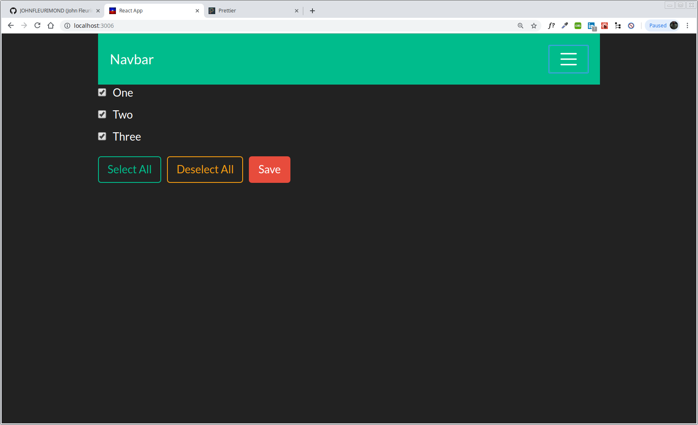

# My Awesome Project
This is a Simple React checkbox application that allows you to select & deselect individually, all, or save the selected.

## How It's Made:
This application is made with React & Bootstrap.

## Optimizations.
I would like to incorporate this with my React-To-Do Application and make their own Components for checkbox and input. This week I have been doing a App a day and I really wasn't good with state or passing props and this will help get better and have better understanding.

I also want to know how to use or install `gh-pages`

## Lessons Learned:
Our Checkbox component is a stateless functional component that receives three props:

`label` is a text that represents the name of the checkbox and it also rendered next to that checkbox.
`isSelected` is a boolean value that tells React whether that checkbox should be rendered selected or deselected.
`onCheckboxChange` is a callback function that React will call when a user selects or deselects the checkbox.
The `Checkbox` component renders `div` element with a Bootstrap class name that we use for styling. Inside of it we have `label` element with two children:

1. `input` element
2. `label` text
The `input` element renders the checkbox. It has 4 properties:

1. `type` - the type of the input: `checkbox` in our case.
2. `name` - the name of the input: an option name passed as a prop from a parent App component. It will be either `One`, `Two` or `Three`.
3. `checked` - whether the `checkbox` is selected or not. The value comes from the prop from a parent `App` component.
4. `onChange` - the `change` event handler: `onCheckboxChange` function will be called when user selects or deselects the checkbox.

I recognize that our input element is a controlled component because we "control" the checked property by providing our own value that comes from `isSelected` prop. If you're not sure about the difference between controlled components and uncontrolled components, then I recommend you read this tutorial.

 React calls our `onCheckboxChange` callback function that references `handleCheckboxChange` function in a parent App component. `handleCheckboxChange` will update `App` component's state and the App component will re-render all Checkbox components.

## portfolio:

**WEBSITE:** https:/johnfleurimond.com

## Installation

1. Clone repo
2. `cd` into folder
3. Run `npm install`
4. Run `npm install bootstrap`

## Usage

1. run `npm start`
